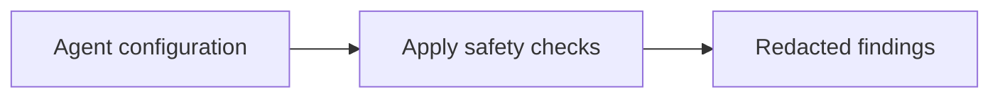

<!-- readme-refresh:start -->
<p align="center">
  <picture>
    <source media="(prefers-color-scheme: dark)" srcset="assets/readme-banner.png">
    <source media="(prefers-color-scheme: light)" srcset="assets/readme-banner.png">
    
  </picture>
</p>

<h1 align="center">🛡️ ConfigFlare</h1>

<p align="center"><strong>Catch risky MCP and AI-agent configuration without exposing secret values.</strong></p>

<p align="center">
  <a href="https://github.com/al1re3a/configflare/actions/workflows/ci.yml"></a>
  <a href="https://www.python.org/"></a>
  <a href="LICENSE"></a>
  <a href="https://github.com/al1re3a/configflare/stargazers"></a>
  <a href="https://github.com/al1re3a/configflare/issues"></a>
</p>

<p align="center">
  <a href="https://github.com/al1re3a/configflare"></a>
  <a href="CONTRIBUTING.md"></a>
  <a href="SECURITY.md"></a>
</p>

<p align="center">
  
</p>

> [!NOTE]
> ConfigFlare reports risky settings and locations without printing configured secret values.

## 📑 Contents

- [At a glance](#-at-a-glance)
- [Why](#why)
- [Checks](#checks)
- [Output](#output)
- [CI](#ci)
- [Development](#development)

---

## 🔎 At a glance

| | |
|---|---|
| **Purpose** | Security linter for MCP and AI-agent configuration files — catches risky settings without leaking secrets. |
| **Input** | Agent configuration |
| **Output** | Redacted findings |
| **Runtime** | Python 3.10+ |
| **CI** | ✅ Linux · Windows |
| **Status** | ✅ Maintained |

<details>
<summary><strong>🧭 How it works</strong></summary>



</details>

<details>
<summary><strong>📁 Repository layout</strong></summary>

```text
configflare/
├── .github/
├── src/
├── tests/
├── examples/
├── pyproject.toml
└── README.md
```

</details>

<details>
<summary><strong>🤝 Contributors</strong></summary>

<br>
<a href="https://github.com/al1re3a/configflare/graphs/contributors">
  
</a>

</details>
<!-- readme-refresh:end -->

**Find the dangerous MCP setting before an agent finds it.**

ConfigFlare is a zero-runtime-dependency Python CLI that audits MCP and coding-agent configuration for hardcoded credentials, missing commands, whole-disk access, insecure endpoints, malformed schemas, and permission-bypass flags.

```bash
pip install -e .
configflare . --fail-on high
```

## Why

Coding agents can execute commands and reach sensitive data. Their small JSON configuration files deserve the same review discipline as application code. ConfigFlare produces deterministic, secret-safe reports locally—no source or credentials are uploaded.

## Checks

- Invalid JSON and malformed `mcpServers` entries
- Missing or unavailable executables
- Hardcoded values under token, secret, password, and key fields
- Full filesystem roots passed to tools
- Permission and sandbox bypass arguments
- Non-local HTTP endpoints without TLS
- Stable fingerprints for CI deduplication

Credential values are never copied into findings.

## Output

```bash
configflare ~/.config --format text
configflare .mcp.json --format markdown
configflare . --format json --fail-on critical
```

Exit code `2` means the selected risk threshold was reached. Exit code `0` means the policy passed.

## CI

```yaml
- run: python -m pip install .
- run: configflare . --fail-on high
```

## Development

```bash
python -m pip install -e .
python -m unittest discover -s tests -v
```

See `examples/unsafe.mcp.json` for an intentionally unsafe fixture.

## License

MIT
